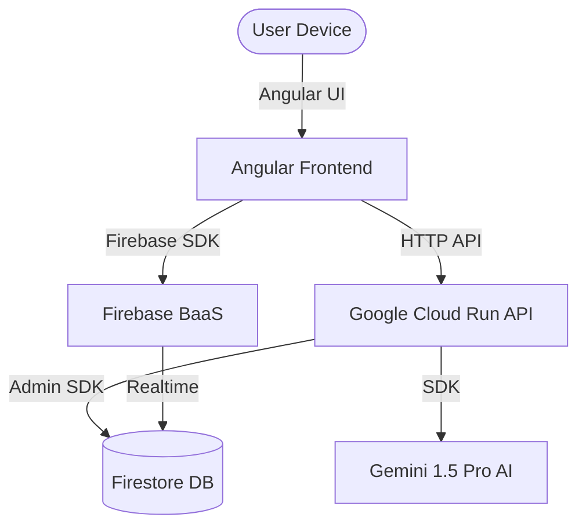

# 🚀 Google Full Stack (GFS)


## The Ultimate "Google-First" Development Ecosystem

Welcome to the **Google Full Stack**, a high-performance, enterprise-ready architecture that leverages the best of Google's ecosystem to build, deploy, and scale modern AI-powered applications.

This repository serves as a **production-ready blueprint** for developers who want to move fast without compromising on security, scalability, or intelligence.

---

### 🏗️ Architecture Stack

The Google Full Stack is built on four core pillars:

1.  **Frontend (Angular):** The enterprise-standard framework for building scalable, high-performance web applications.
2.  **BaaS & Auth (Firebase):** Instant backend infrastructure including Authentication, Realtime Firestore, and global Hosting.
3.  **Microservices (Google Cloud Run):** Fully managed serverless compute for your custom Node.js/Express APIs.
4.  **AI Intelligence (Gemini 1.5 Pro):** Native integration with Google's most capable multimodal AI models via the Gemini API.



---

### 🔥 Key Features

- **⚡ Blazing Fast Initialization:** Use the `googleStack.sh` script to bootstrap your entire environment in seconds.
- **🤖 Built for AI:** Native hooks for **Gemini** to provide intelligent features like automated content generation, RAG, and multimodal analysis.
- **🔒 Secure by Design:** Pre-configured IAM roles, Firebase Security Rules, and isolated Cloud Run environments.
- **📈 Infinite Scale:** Leverages Google's global infrastructure so you can scale from 1 to 1 million users with zero configuration.

---

### 🛠️ Quick Start

#### 1. Clone & Bootstrap
```bash
git clone https://github.com/nicholasdudek/GoogleFullStack.git
cd GoogleFullStack
./googleStack.sh
```

#### 2. Configure Environment
Add your Google Cloud and Firebase credentials:
```bash
cd google-stack-app
# Add your GEMINI_API_KEY to the cloud-run-backend environment
```

#### 3. Run Locally
```bash
# Frontend
cd google-stack-app/frontend
npm start

# Backend
cd ../cloud-run-backend
npm run dev
```

---

### 🛠️ Repository Structure

- `/googleStack.sh`: The master bootstrap script.
- `/google-stack-app`:
    - `/frontend`: Angular 17+ Application.
    - `/firebase-backend`: Firebase Configuration & Security Rules.
    - `/cloud-run-backend`: Node.js/Express API with Gemini integration.

---

### 🌟 Why Google Full Stack?

In the modern AI-era, speed is the only moate. By choosing the **Google Full Stack**, you are alignment with the most integrated developer experience on the planet. From prototype to IPO, this stack grows with you.

---

### 🤝 Contributing

We welcome contributions to the GFS blueprint! Please see our [Contributing Guide](CONTRIBUTING.md) for details.

### 📄 License

MIT License. See [LICENSE](LICENSE) for more information.

---

Built with ❤️ by [Nicholas Dudek](https://github.com/nicholasdudek) 🚀
